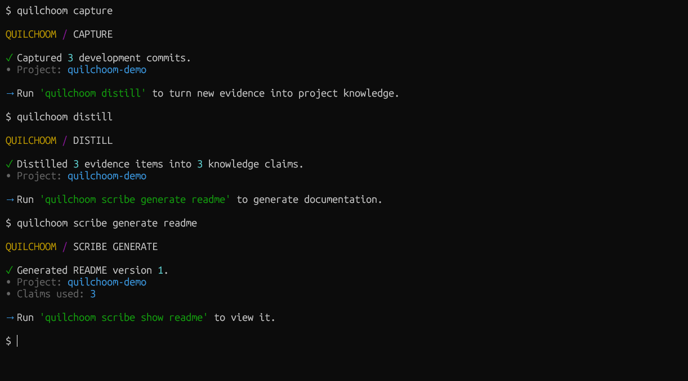

# Quilchoom

**THE STORY BEHIND YOUR CODE**

Quilchoom is an open-source developer tool that turns your development history into traceable project knowledge and useful documentation.

[](https://pypi.org/project/quilchoom/)
[](https://pypi.org/project/quilchoom/)
[](https://github.com/manatunga/quilchoom/actions/workflows/ci.yml)
[](https://codecov.io/gh/manatunga/quilchoom)
[](LICENSE)
[](CONTRIBUTING.md)



## Highlights

- **Development history as evidence** — Capture Git activity as structured development evidence instead of treating repository history as disposable context.
- **Traceable project knowledge** — Distill development evidence into knowledge claims that remain connected to the evidence behind them.
- **Evidence-backed documentation** — Generate documentation from accumulated project knowledge rather than relying on the current source tree alone.
- **Versioned and stale-aware** — Preserve generated document versions and identify when their underlying knowledge is no longer current.
- **Local-first** — Keep Quilchoom's project state and development knowledge in a local `.quilchoom/` workspace.
- **Bring your own API key** — Use your own AI-provider credentials without storing API keys in project configuration.

<br>

## How it works

Quilchoom builds documentation through a traceable pipeline from development activity to generated artifacts:

```
Development activity
        │
        ▼
      Capture
        │
        ▼
Evidence ──► Reconstructed history
        │
        ▼
      Distill
        │
        ▼
 Project knowledge
        │
        ▼
      Scribe
        │
        ▼
   Documentation
```

**Capture** records development activity as structured evidence. In *v0.1*, that activity comes from Git commits.

**History** reconstructs captured evidence into a readable view of how the project developed.

**Distill** interprets new evidence into project knowledge. Knowledge claims remain linked to the evidence used to derive them, keeping interpretation traceable.

**Scribe** generates documentation from active project knowledge and preserves the knowledge claims used for each generated version.

In *v0.1*, Git is the first development activity source and README generation is the first supported documentation workflow.

<br>

## Installation

Quilchoom requires **Python 3.14 or later** and **Git**.

Install it as an isolated command-line tool with [uv](https://docs.astral.sh/uv/):

```bash
uv tool install quilchoom
```

Or with [pipx](https://pipx.pypa.io/):

```bash
pipx install quilchoom
```

Verify the installation:

```bash
quilchoom --version
```

Both `quilchoom` and the shorter `qlchm` command are installed:

```bash
quilchoom --help
qlchm --help
```

AI-backed operations require an OpenAI API key. Quilchoom uses your own provider credentials; configuration is covered below.

<br>

## Quick start

Navigate to the Git repository you want Quilchoom to track, then follow the workflow below.

### 1. Initialize the workspace — `quilchoom init`

Initialize Quilchoom in the current Git repository:

```bash
# Initialize Quilchoom for the current Git repository
quilchoom init
```

This creates the local .quilchoom/ workspace, configuration, and project state.

### 2. Capture development activity — `quilchoom capture`

Capture Git development activity that Quilchoom has not seen yet:

```bash
# Capture new Git development activity
quilchoom capture
```

Captured commits become development events and evidence that Quilchoom can reconstruct and interpret. Running `capture` again only captures development activity Quilchoom has not already recorded.


### 3. Inspect the history — `quilchoom log`

View the development history reconstructed from captured evidence:

```bash
# Show captured development history
quilchoom log

# Show at most 10 history entries (-n/--limit)
quilchoom log --limit 10
```

Inspecting the history is optional, but it lets you see what Quilchoom has captured before interpretation.

### 4. Configure your API key

AI-backed operations use your own OpenAI API credentials.

**Linux / macOS**

```bash
export OPENAI_API_KEY="your-api-key"
```

**Windows PowerShell**

```powershell
$env:OPENAI_API_KEY="your-api-key"
```

The API key is read from the environment and is not stored in `.quilchoom/config.toml`.

### 5. Distill project knowledge — `quilchoom distill`

Interpret new development evidence into traceable project knowledge:

```bash
# Distill newly captured evidence
quilchoom distill
```

Knowledge claims remain connected to the evidence used to derive them. Running `distill` again processes new evidence rather than reinterpreting development activity that has already been distilled.

### 6. Generate documentation — `quilchoom scribe generate readme`

Generate a README from the project's active knowledge:

```bash
# Generate a README from active project knowledge
quilchoom scribe generate readme
```

Quilchoom stores the generated README as a version rather than immediately overwriting your repository's `README.md`. Generating again creates a new document version.

### 7. View generated documentation — `quilchoom scribe show readme`

Print the latest generated README directly to the terminal:

```bash
# Show the latest generated README
quilchoom scribe show readme

# Show a specific generated version (-V/--version)
quilchoom scribe show readme --version 1
```

### 8. Export generated documentation — `quilchoom scribe export readme`

Export a generated README to the filesystem:

```bash
# Export the latest version
quilchoom scribe export readme README.md

# Export a specific version (-V/--version)
quilchoom scribe export readme README.md --version 1

# Overwrite an existing destination without prompting (-f/--force)
quilchoom scribe export readme README.md --force
```

Without `--force`, Quilchoom prompts before overwriting an existing destination when running interactively.

### 9. Check project status — `quilchoom status`

Inspect the current state of the Quilchoom workflow:

```bash
# Show the current project workflow status
quilchoom status
```

`status` summarizes captured and pending development activity, project knowledge, and generated documentation so you can see what needs attention next.

### Debugging

Quilchoom handles expected errors with concise CLI messages by default. When diagnosing an unexpected failure, enable debug mode globally:

```bash
# Show the underlying exception and traceback
quilchoom --debug distill

# Debug document generation
quilchoom --debug scribe generate readme
```

`--debug` is a global option and must appear before the command.

See the [troubleshooting guide](docs/troubleshooting.md) for common Git,
initialization, credential, and provider errors, with steps to resolve them.

<br>

## Commands

| Command | Description |
| --- | --- |
| `quilchoom init` | Initialize Quilchoom for the current Git repository. |
| `quilchoom capture` | Capture new Git development activity. |
| `quilchoom log` | Show reconstructed development history. |
| `quilchoom distill` | Distill new evidence into traceable project knowledge. |
| `quilchoom status` | Show the current project workflow status. |
| `quilchoom scribe generate readme` | Generate a README from active project knowledge. |
| `quilchoom scribe show readme` | Print a generated README to the terminal. |
| `quilchoom scribe export readme PATH` | Export a generated README to a filesystem path. |

`qlchm` is available as a shorthand for `quilchoom`, so any command can also be written using the shorter form:

```bash
qlchm capture
qlchm distill
qlchm scribe generate readme
```

For the complete command interface:

```bash
# Show all commands and global options
quilchoom --help

# Show options for a specific command
quilchoom log --help

# Show options for a nested command
quilchoom scribe export readme --help
```

<br>

## Traceability by design

Quilchoom is built around a simple principle: generated documentation should have a traceable basis in the development activity that produced the project.

### Evidence before interpretation

Development activity is captured as evidence before it becomes project knowledge. Quilchoom keeps the original evidence separate from the interpretations derived from it.

### Knowledge linked to its sources

Knowledge claims retain references to the evidence used to derive them. Quilchoom distinguishes observations from inferences rather than treating inferred developer intent as established fact.

### Documentation linked to knowledge

Generated document versions retain the knowledge claims used to produce them, creating a traceable path:

```text
Development activity → Evidence → Project knowledge → Documentation
```

### Versioned and stale-aware

Generated documentation is versioned rather than silently replaced. If knowledge referenced by a generated document is later corrected or invalidated, Quilchoom can identify that document as stale.

### Local-first

Quilchoom stores project state locally in `.quilchoom/`. Project knowledge, evidence, document history, and configuration remain part of the local Quilchoom workspace.

API credentials are kept outside that workspace and supplied through the environment.

<br>

## Configuration

Quilchoom stores project configuration in `.quilchoom/config.toml`.

Quilchoom v0.1 supports OpenAI for knowledge interpretation and document generation. A default configuration looks like:

```toml
[ai]
provider = "openai"
model = "gpt-5.4-mini"
```

The model can be changed by editing the `model` value.

### API credentials

Credentials are supplied through the environment rather than stored in project configuration.

**Linux / macOS**

```bash
export OPENAI_API_KEY="your-api-key"
```

**Windows PowerShell**

```powershell
$env:OPENAI_API_KEY="your-api-key"
```

Quilchoom does not write your OpenAI API key to `.quilchoom/config.toml` or its local database.

### Bring your own API key

Quilchoom Core does not impose its own AI generation quota. AI requests use your configured provider credentials, so usage and associated costs are determined by your provider and selected model.

<br>

## Project status

Quilchoom is currently in **Alpha**. Version **0.1.0** is the first public release and establishes the complete core workflow from Git development activity to traceable project knowledge and generated README documentation.

### Where Quilchoom is heading

README generation is the starting point, not the boundary of Quilchoom's documentation model.

The broader direction for Quilchoom Core is to turn accumulated project knowledge into more forms of repository documentation, such as ADRs, changelogs, contributing guides, and architecture documentation, while preserving the same evidence and traceability principles.

Quilchoom is early-stage software. Commands, configuration, interfaces, and internal architecture may evolve as the project gains real-world usage and feedback.

<br>

## Contributing

Quilchoom is open source and early in its development. Contributions, bug reports, feature ideas, and documentation improvements are welcome.

See [CONTRIBUTING.md](CONTRIBUTING.md) for development setup and contribution guidelines.

<br>

## License

Quilchoom Core is licensed under the [Apache License 2.0](LICENSE).
